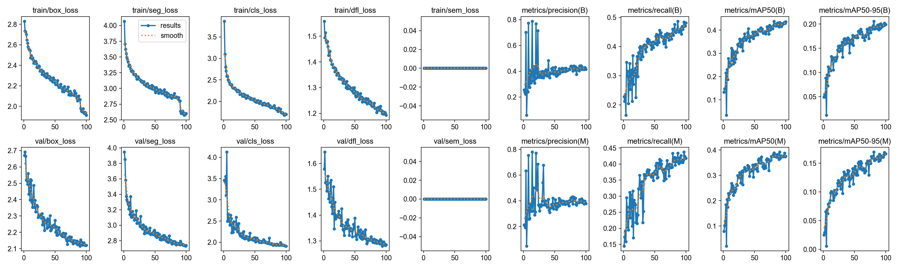
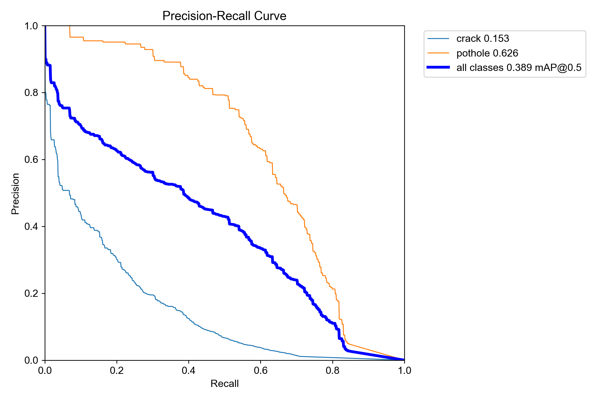
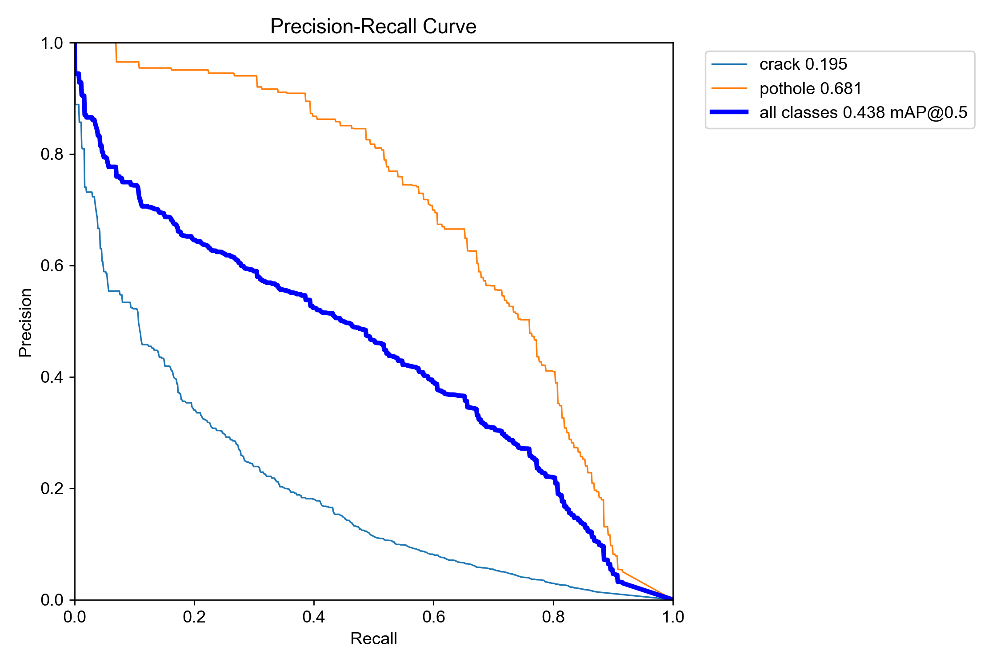

# ADAS Video ML Model Binary Store

## Overview

For use with [https://github.com/t4g/ml-adas-pilot] platform:

A modular CLI application that processes dashcam video (file or RTSP stream) and outputs an MP4 with ADAS-style overlays including lane detection, road damage detection, pedestrian detection with collision-risk highlighting, and forward motion estimation.

_or your own YOLOv8 project_

___

Due to large complexity of training models, included here are a few pretrained models to get you started.

## Road Damage Segmentation Models - Index & Ranking (AUTO REPORT)

All models trained on `yolov8n-seg.pt` base, dataset: `yolo_road_damage_seg/dataset.yaml`

### Ranking

| Rank | Model | mAP50 (Box) | mAP50-95 (Box) | mAP50 (Mask) | mAP50-95 (Mask) | Precision | Recall |
|------|-------|-------------|----------------|-------------|-----------------|-----------|--------|
| 1 | **train_v2** | **0.4362** | **0.1995** | **0.3758** | **0.1664** | **0.4153** | **0.4814** |
| 2 | cpu_test | 0.0864 | 0.0341 | 0.1007 | 0.0378 | 0.2029 | 0.1318 |
| 3 | train4 | 0.0000 | 0.0000 | 0.0000 | 0.0000 | 0.0001 | 0.0017 |

## Detailed Scores

### #1 — train_v2 (Best)

- **Path:** `runs/segment/runs/damage_seg/train_v2/weights/best.pt`
- **Epochs:** 100 (completed)
- **Batch:** 8 | **Image size:** 640 | **Device:** cpu
- **Model size:** 6.5 MB
- **Box mAP50:** 0.4362 | **Box mAP50-95:** 0.1995
- **Mask mAP50:** 0.3758 | **Mask mAP50-95:** 0.1664
- **Precision:** 0.4153 | **Recall:** 0.4814
- **Val box_loss:** 2.120 | **Val cls_loss:** 1.911

> Full 100-epoch training run. Highest scores across all metrics by a wide margin.
> This is the production model.

### #2 — cpu_test

- **Path:** `runs/segment/runs/damage_seg/cpu_test/weights/best.pt`
- **Epochs:** 3 (of 3)
- **Batch:** 4 | **Image size:** 320 | **Device:** cpu
- **Model size:** 6.4 MB
- **Box mAP50:** 0.0864 | **Box mAP50-95:** 0.0341
- **Mask mAP50:** 0.1007 | **Mask mAP50-95:** 0.0378
- **Precision:** 0.2029 | **Recall:** 0.1318
- **Val box_loss:** 4.295 | **Val cls_loss:** 2.159

> Quick 3-epoch smoke test at 320px. Low accuracy but functional detections.
> Appeared to outperform train4 on the camfish.mov test video because train4
> essentially failed to converge (see below).

### #3 — train4 (Failed)

- **Path:** `runs/segment/runs/damage_seg/train4/weights/best.pt`
- **Epochs:** 7 (of 100, stopped early or crashed)
- **Batch:** 4 | **Image size:** 640 | **Device:** mps
- **Model size:** 19 MB
- **Box mAP50:** 0.0000 | **Box mAP50-95:** 0.0000
- **Mask mAP50:** 0.0000 | **Mask mAP50-95:** 0.0000
- **Precision:** 0.0001 | **Recall:** 0.0017
- **Val cls_loss:** 2016.2 (exploded)

> Training diverged — classification loss exploded to 2016.2 (vs ~1.9 for train_v2).
> Only completed 7 of 100 epochs. The saved "best.pt" is essentially an untrained model.
> The 19 MB file size (vs 6.5 MB for converged models) suggests optimizer state was saved
> before any meaningful learning occurred. **Do not use this model.**

### Not ranked — train, train2, train3

These directories exist but contain no `results.csv` — training was likely interrupted
before completing a single validation epoch. No usable weights.

## Recommendation

Use **train_v2** for all inference:

```bash
--damage-model runs/segment/runs/damage_seg/train_v2/weights/best.pt
```


 ```text
  ┌─────────┬───────────┬──────────────┬────────────┬───────────────┐    
  │  Class  │ Box mAP50 │ Box mAP50-95 │ Mask mAP50 │ Mask mAP50-95 │
  ├─────────┼───────────┼──────────────┼────────────┼───────────────┤    
  │ all     │ 0.438     │ 0.206        │ 0.389      │ 0.169         │    
  ├─────────┼───────────┼──────────────┼────────────┼───────────────┤    
  │ crack   │ 0.195     │ 0.074        │ 0.153      │ 0.044         │    
  ├─────────┼───────────┼──────────────┼────────────┼───────────────┤
  │ pothole │ 0.681     │ 0.338        │ 0.626      │ 0.294         │    
  └─────────┴───────────┴──────────────┴────────────┴───────────────┘    
  ```
  
  Pothole detection is strong (68% mAP50). Crack detection is lower due  
  to the more fragmented nature of cracks, but still functional.

  The model is at:
  ```runs/segment/runs/damage_seg/train_v2/weights/best.pt```

  Use it with the pipeline:

  ```bash
  python -m adas_pipeline --input video.mp4 --output out.mp4 \
      --damage-model runs/segment/runs/damage_seg/train_v2/weights/best.pt
  ```

## Results

Leading model: [segment/runs/damage_seg/train_v2]








## Authors

Author: [@t4g] (Kyle Younge)